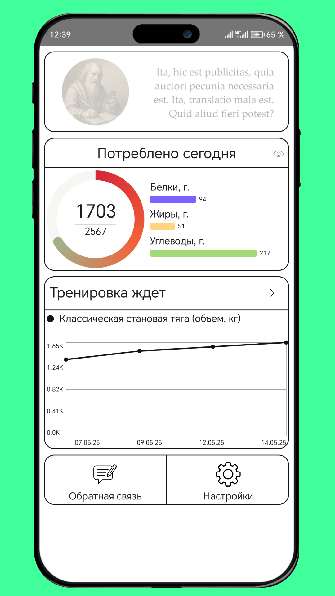
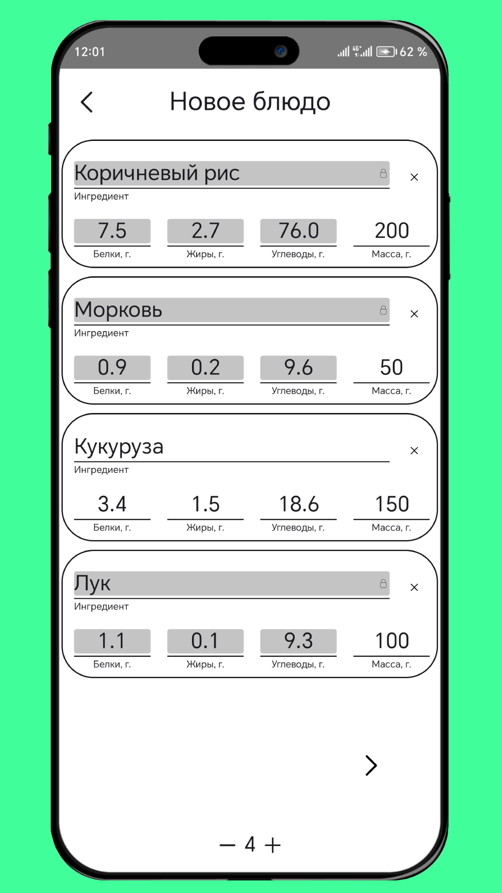
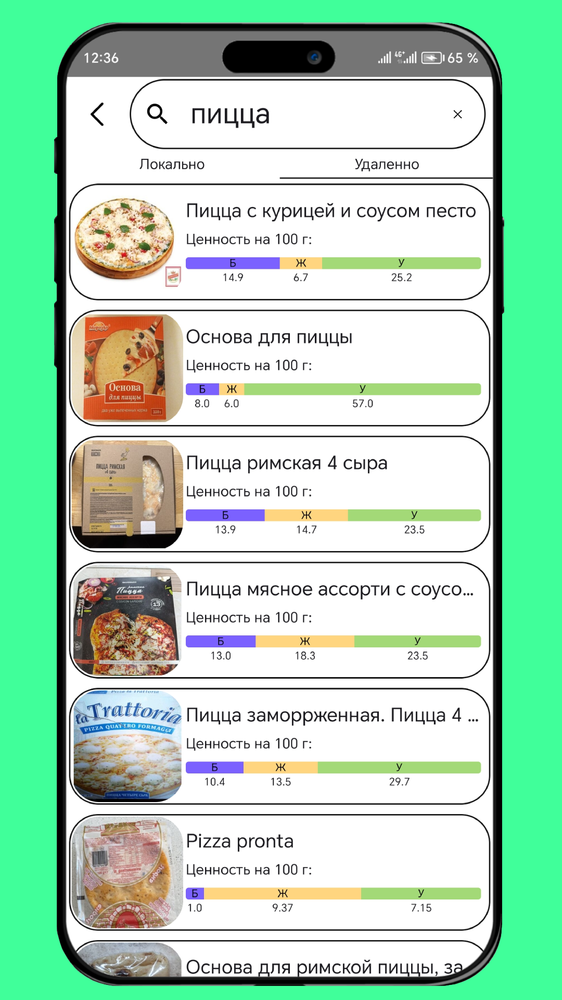
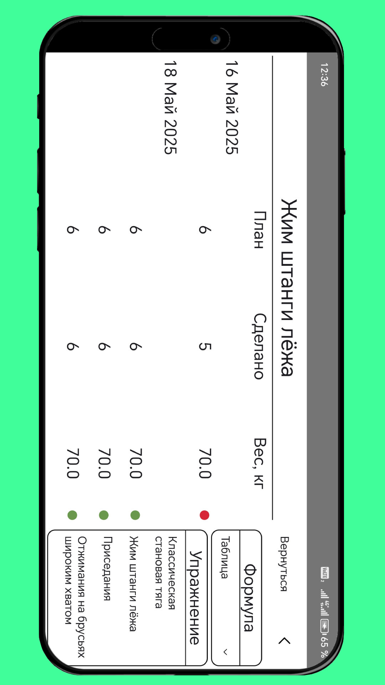
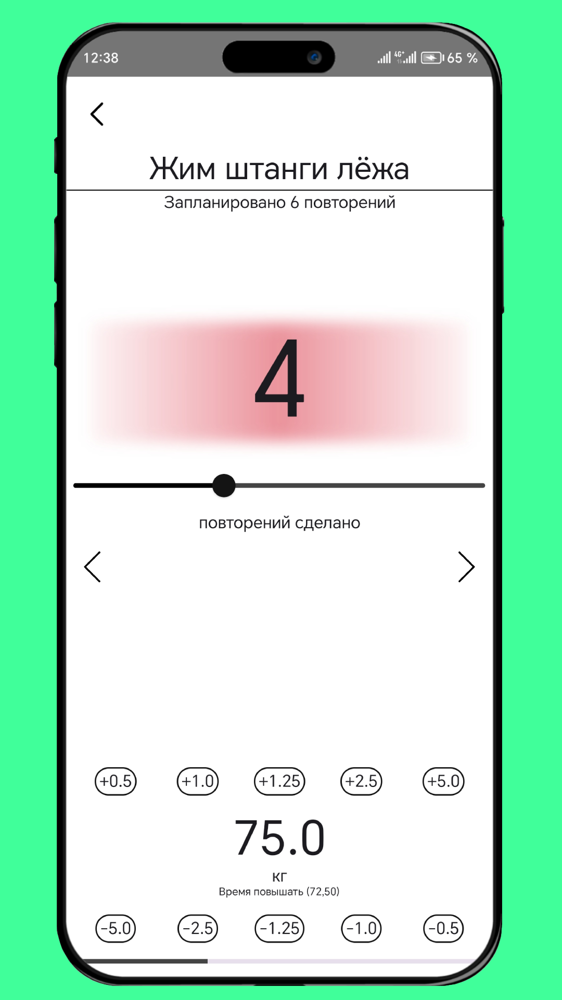

# О приложении
Данное приложение предназначено для отслеживания прогресса силовых тренировок и питания

Возможности:

- Создание расписания тренировок по дням недели
- Сохранение прогресса по ходу выполнения тренировки
- Калькулятор калорий и БЖУ, потребляемых в течение дня
- Расчет БЖУ собственных рецептов
- Просмотр своих силовых показателей в виде графиков либо таблицы

## Стек

- **Kotlin**

- **Jetpack Compose**

- **Coroutines + Flow**

- **Hilt** - DI

- **Room** - все базы данных

- **Retrofit** - сетевые запросы к Open Food Facts API, заполнение google формы отзыва

- **Proto DataStore** - хранение настроек и временных параметров приложения

- **WorkManager** - сброс показателей в назначенное время

- **JUnit + Google Truth** - unit тестирование

- **ComposeCharts by ehsannarmani** - графики

## Скриншоты

  
  
  

  
  

### Дополнительно

Приложение является учебным pet-проектом, изначально написанным без четкого следования принципам чистой архитектуры:
все use cases были написаны уже после завершения работы над приложением и представляют собой вынесенную из viewmodels логику.
Причиной для создания use cases стала необходимость в практике написания unit тестов, которые я оставил напоследок, чтобы
не разбираться во всем одновременно - весь процесс написания приложения сопровождался ручным тестированием.

[RuStore](https://www.rustore.ru/catalog/app/com.velosiped.notes)
