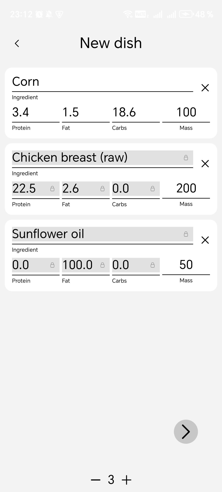

# О приложении
Данное приложение предназначено для отслеживания прогресса силовых тренировок и питания

Возможности приложения:

- Создание расписания тренировок по дням недели
- Сохранение прогресса по ходу выполнения тренировки
- Калькулятор калорий и БЖУ, потребляемых в течение дня
- Расчет БЖУ собственных рецептов
- Просмотр своих силовых показателей в виде графиков либо таблицы

[RuStore](https://www.rustore.ru/catalog/app/com.velosiped.notes)

## Стек

- **Kotlin**

- **Jetpack Compose**

- **Coroutines + Flow**

- **Hilt** - DI

- **Room** - базы данных

- **Retrofit** - сетевые запросы к Open Food Facts API

- **Proto DataStore** - хранение настроек и временных данных приложения

- **WorkManager** - сброс показателей в назначенное время

- **Coil** - сетевые и пользовательские изображения

- **ComposeCharts by ehsannarmani** - графики

## Скриншоты

  
  
  

  
  

